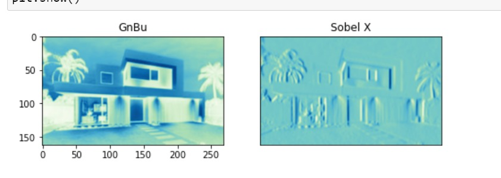
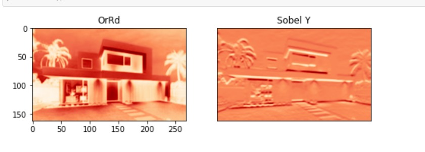
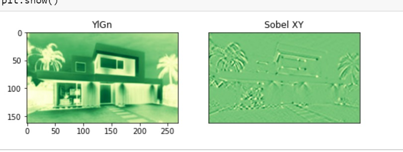
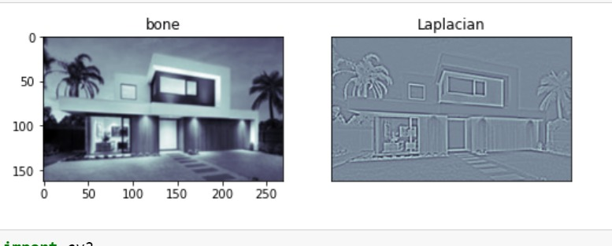
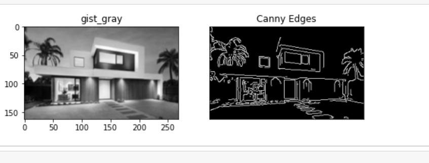

# Edge-Detection
## Aim:
To perform edge detection using Sobel, Laplacian, and Canny edge detectors.

## Software Required:
Anaconda - Python 3.7

## Algorithm:
### Step 1:
Import the required packages for further process.

### Step2:
Read the image and convert the bgr image to gray scale image.

### Step3:
Use any filters for smoothing the image to reduse the noise.

### step4:
Apply the respective filters -Sobel,Laplacian edge dectector and Canny edge dector.

### Step5:
Display the filtered image using plot and imshow.


 
## Program:

``` Python
# Import the packages
import cv2
import matplotlib.pyplot as plt
image = cv2.imread("image1.png")
gray_image = cv2.cvtColor(image,cv2.COLOR_BGR2GRAY)
new_image = cv2.GaussianBlur(gray_image,(3,3),0)


### SOBEL EDGE DETETCTOR:
### SOBEL X:

sobelx = cv2.Sobel(new_image,cv2.CV_64F,1,0,ksize = 5)
plt.figure(figsize=(8,8))
plt.subplot(1,2,1)
plt.imshow(new_image,cmap = 'GnBu')
plt.title('GnBu')
plt.subplot(1,2,2)
plt.imshow(sobelx,cmap = 'GnBu')
plt.title("Sobel X")
plt.xticks([])
plt.yticks([])
plt.show()
#### SOBEL Y:

sobely = cv2.Sobel(new_image,cv2.CV_64F,0,1,ksize = 5)
plt.figure(figsize = (8,8))
plt.subplot(1,2,1)
plt.imshow(new_image,cmap = 'OrRd')
plt.title('OrRd')
plt.subplot(1,2,2)
plt.imshow(sobely,cmap = 'OrRd')
plt.title("Sobel Y")
plt.xticks([])
plt.yticks([])
plt.show()

### SOBEL XY:

sobelxy = cv2.Sobel(new_image,cv2.CV_64F,1,1,ksize=5)
plt.figure(figsize = (8,8))
plt.subplot(1,2,1)
plt.imshow(new_image,cmap = 'YlGn')
plt.title('YlGn')
plt.subplot(1,2,2)
plt.imshow(sobelxy,cmap = 'YlGn')
plt.title('Sobel XY')
plt.xticks([])
plt.yticks([])
plt.show()


# LAPLACIAN EDGE DETECTOR

laplacian = cv2.Laplacian(new_image,cv2.CV_64F)
plt.figure(figsize = (8,8))
plt.subplot(1,2,1)
plt.imshow(new_image,cmap = 'bone')
plt.title('bone')
plt.subplot(1,2,2)
plt.imshow(laplacian,cmap = 'bone')
plt.title('Laplacian')
plt.xticks([])
plt.yticks([])
plt.show()


# CANNY EDGE DETECTOR
canny_edge = cv2.Canny(new_image,120,150)
plt.figure(figsize = (8,8))
plt.subplot(1,2,1)
plt.imshow(new_image,cmap = 'gist_gray')
plt.title('gist_gray')
plt.subplot(1,2,2)
plt.imshow(canny_edge,cmap = 'gist_gray')
plt.title('Canny Edges')
plt.xticks([])
plt.yticks([])
plt.show()


```
## Output:
### SOBEL EDGE DETECTOR
### sobel x



### sobel y



### sobel xy


### LAPLACIAN EDGE DETECTOR


### CANNY EDGE DETECTOR


## Result:
Thus the edges are detected using Sobel, Laplacian, and Canny edge detectors.
